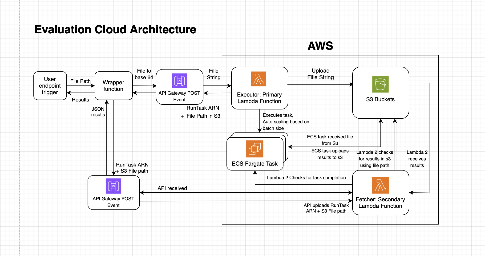
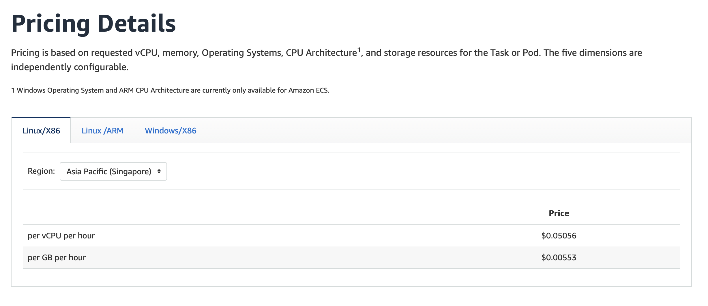
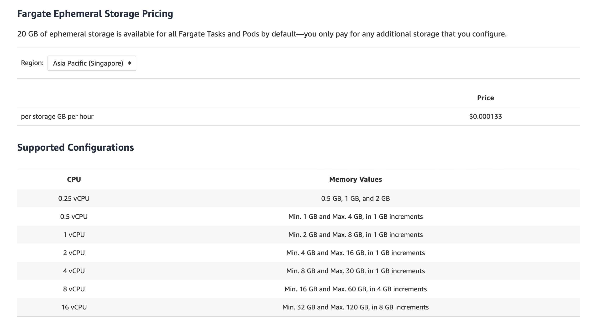

# RAG EVALUATION PIPELINE 


## Table of Contents

- [General Pipeline Architecture](#general-pipeline-architecture)
- [Rationale and Costs](#rationale-and-costs-)
- [Steps to Re-create Pipeline](#steps-to-re-create-pipeline)
- [Upload File Format](#required-format-for-file-upload)
- [Documentation](#documentation)

## Introduction
The RAG (Retrieval-Augmented Generation) Evaluation Pipeline is designed to evaluate the performance of RAG responses by leveraging LLMs to provide detailed metric-based analysis. 

## General Pipeline Architecture
The evaluation pipeline uses the general architecture shown below:
user-> wrapper-function-> API-Gateway-> Lambda -> S3/ECS Fargate Task -> S3 -> Lambda -> API-Gateway -> wrapper-function -> user.
There are two main phases: execution and fetching

**Execution**
- The wrapper functions handles the user's file uploads, converting it to a base64 string, and sending over as a JSON payload to the API Gateway
- API Gateway uses the POST method to provide the payload to the primary Lambda function
- The primary Lambda handles the payload and saves it as an .env file in S3 
- The primarg Lambda executes ECS RunTasks, using the .env file from S3 as the input data for evaluation task
- ECS Fargate Task performs the evaluation and uploads the results to S3

**Fetchching**
- The wrapper function periodically calls the secondary Lambda function with a customisable refresh rate
- The secondary Lambda pings the ECS Task to see if it has stopped and once so, pulls results from S3
- The secondary Lambda then processes the results and sends back to API Gateway
- API Gateway passes the results to the user via the wrapper function
- The wrapper function creates and renders a local HTML file and prints the direct results in the user's console/terminal window

<br>



## Rationale and Costs 
The rationale behind this choice of architecture comes from a place of both efficacy and also efficiency. Here are several
reasons why a multi-Lambda + Fargate architecture is chosen:
- A standalone Lambda function does not have enough space to accommodate all the models for evaluation in a single container (max 10 GB)
- A standalone Lambda function may not have enough runtime to perform evaluations (max 15 mins)
- Running a single Lambda function for Fargate, will have to incur running time costs for letting the function sit and run continously to ping for Fargate updates
- Running a single Lambda function, with a single API request to await Fargate task completion may not have sufficient timeout limits: (29 seconds for API timeout, 15 mins for Lambda)

The architecture is designed to overcome these challenges by:

- Using Fargate for evaluation, which has a much larger container size limit, and memory, and unlimited runtime for evaluations
- Using Fargate for up-scaling by running concurrent tasks, for large batches for questions to reduce latency
- Leveraging two Lambda functions to split workload, each with runtime of less than 1 minute required to perform all jobs and saving costs
- Triggering the second Lambda on demand, which automatically closes if the task is not done. This overcomes the 15 min timeout for a single Lambda function

Downsides:
- Running Fargate is costlier. See [AWS Fargate Pricing](https://aws.amazon.com/fargate/pricing/).
- Fargate charges per-vCPU hour and per GB hour pricing, making it the same price to run 1 task for 2 minutes vs 2 tasks for 1 minute. However, the start-up latency, which is around 6 minutes per task is also included, making parallel tasking more expensive
<br>



## Steps to Re-create Pipeline

### Prerequisites 
- Create an S3 Bucket and upload models files to said bucket
- Create Code Commit git repo for the main evaluation function and for secondary Lambda
- Create ECR to store the images
- Create another S3 bucket to host non-versioning evaluation results, set the bucket life cycle to delete items within 1 day 

### Code Commit Files
- Create Dockerfile, BuildSpec.YML, for the main evaluation code
- Create Dockerfile, BuildSpec.YML, for the secondary lambda code

### Codebuild
- Create a Codebuild Service Role that can S3 ListBucket, GetObject, Get AuthorizationToken from CodeCommit and Upload to ECR
- Create a Codebuild project and build the main evaluation code to a Docker image, ensure that at least 20 minutes is given for build timeout duration
- Create another Codebuild project and build the secondary lambda code to another separate Docker image

### ECS 
- Create an ECS cluster
- Create ECS TaskRole and ECS TaskExecutionRole
- Edit the TaskRole and taskExecutionRole policy to include permissions.
    - ECS TaskRole must be manually created. Ensure it has permission to upload to S3
    - ECS TaskExecutionRole can be auto-created, but its policy can not be changed, you have to make a new policy and attach it

### ECS Task Definition
- Create an ECS task definition, use the image for main evaluation stored in ECR as the container image.
- Ensure enough task CPU, memory and ephemeral storage: cater 4vCPUS, memory of 16GB, ephemeral storage of 50GB
- Create a unique name for the container, note down this name as you will need it for the environment variable of your primary lambda function
- Under container configurations, input the same CPU, memory limit is same as the task configurations above. Set the hard limit to the memory allocated above in task configuration, and the soft limit to slightly below it
- Once created, select deploy task, and under Networking options in the deploy task menu, note down the VPC subnet id and SG id, as you will need it for the environment variable of your primary lambda function. You do not need to actually deploy the task now

### Lambda 
- Once the task definition is created, create a primary Lambda function under build from scratch (code directly)
- Copy the code over directly from the primary_lambda.py file
- Note that since the primary lambda function is single file, it does not have any dependencies installed, to change the global env 
variables, will have to either change directly inline the code with os.environ["VAR"]= value OR upload a zip file with the dotenv package installed, which will allow you to use the .env file.
- Change the envrionment variables for the subnet ID, SG ID, container name, task definition, cluster name, and S3 bucket name and folder as required
- Ensure its Lambda role policy has the following permissions:
    -IAM/PassRole - arn: ecs taskrole and ecs task execution role
    -ECS/RunTask - arn: specific taskDefinition: E.G "mytask:16" or "mytask:*"
    -S3/ListBucket, PutObject, arn: bucket name + resource paths : "//file.env"
- Under the Lambda's RunTask function, ensure the task definition, S3 Bucket, security groups and VPC used are the ones created earlier

- Create a secondary Lambda function under build from Docker Image
- Deploy the secondary Lambda's Docker image, built from above
- Ensure that is has the following Lambda role policy permissions:
  - IAM/Passrole - arn: ecs taskrole and ecs task execution role
  - ECS/DescribeTask - arn: specific taskDefinition: E.G "mytask:16" or "mytask:*"
  - S3/ListBucket, GetObject, arn: bucket name + resource paths : "//results.txt"
- Ensure function has sufficient timeout, minimally 1 minute, and enough memory of around 200 mb

### API Gateway
- Create new REST API 
- Create new REST API resource for the primary Lambda
    - Create new REST API resource method POST, link to the primary Lambda function
    - Select API keys required (if needed)
    - Under method request, add a new Request Body "application/json", and set "model" to Empty
    - Under Integration Requests tick the Lambda Proxy Integration 
    - Leave all query strings, headers, templates and all other boxes empty
- Create another REST API resource for the secondary lambda with the same settings
- Deploy the API, copy the deployment stage URL, and paste: "https/.../{stage name}/{resource name}" for both two lambdas

### API Requests Wrapper function 
- Create the wrapper function by copying the code over from the REPO
- Do pip-install python-dotenv if the runtime environment has no dotenv package installed
- The API wrapper function can be runned on a local terminal or any IDE, so long as the relevant API keys or IAM authentication is passed
- Ensure the invocation urls are changed based on the new API Gateway URLs
- By changing the FILE variable in the .env file, you can configure it to the path of the dataset you would like to evaluate
- Executed properly, the wrapper function POSTS the file string to the first Lambda, then periodically pings the second Lambda to check for results

## Required Format for File Upload

As of yet, the wrapper function is customised to only be able to process excel files. The format must following the following requirements.
- Column headers must be named `question`, `answer`, `ground_truth`, `contexts` (Ensure context**s** is pluralised and no capitalisation)
- The `contexts` column must have each chunk separated by the stopword `<END>`
```
# Example Excel sheet format for contexts

_|___|______________________________________|___________________|_____________________|___________________|_
 |   |               contexts               |      question     |       answer        |    ground_truth   |
_|___|______________________________________|___________________|_____________________|___________________|_
 | 1 | The weather today is sunny....<END>  | What is the       | The weather is sunny| The weather is    |
 |   | The temperatures are high.....<END>  | weather?          |                     | sunny             |
_|___|______________________________________|___________________|_____________________|___________________|_
 | 2 | The weather today is rainy....<END>  | What is the       | Average rainfull is | Average rainfull  |          
 |   | The temperatures are low.....<END>   | average rainfall? | 600mm               | is 630mm          |
_|___|______________________________________|___________________|_____________________|___________________|_
 |   |                                      |                   |                     |                   |
```
- String literals `" "` are not required to encase each text chunk
- All columns must have same number of rows
- All rows must have fully filled columns, missing or empty entries will cause errors

## Documentation

## 1) Main Evaluation Function

As the name suggest, the `EvaluateModel` calculates various metrics based on the user provided testset.
### Function Overview
- Calculates RAGAS metrics (answer relevancy, faithfulness, context recall, context precision, answer correctness)
- Calculates BERT scores (precision, recall, F1)
- Handles rate limiting for API calls (If used OpenAI or external evaluators_
- Generates a comprehensive report with all calculated metrics


```python
EvaluteModel(
            dataset=None, 
            llm=None,
            ragas_metrics = [answer_correctness, faithfulness, answer_relevancy, context_recall, context_precision]
            other_metrics = ["Bert", "Lynx"],
            )
```
### Parameters
**Parsed dictionary format:**

This class accepts a dictionary format below as input. When uploaded as an excel sheet, additional in built functions in the container image will
handle the parsing of data into the acceptable format
```python
results = {'question':       [ ],
            'answer':        [ ],
            'contexts':     [[ ]] ,
            'ground_truth':  [ ]
}
```
**Metrics:**

This class accepts two types of metrics: RAGAS and Other metrics. When passed over as a JSON payload, all metrics can be 
included in a single list as strings with the correct naming, additional in built functions in the container image will handle the parsing into the acceptable format

Correct Metric Names:
- `answer_correctness`
- `faithfulness`
- `answer_relevancy`
- `context_recall`
- `context_precision`
- `BERT`
- `Lynx`

### Returns
When instantiated, this class immediately returns two outputs: A dictionary containing the averaged final score of all metrics and
a dataframe containing the input data and the scores for each question.

```python
results, df = EvaluateModel(dataset=file_content, ragas_metrics=ragas_metrics, other_metrics=other_metrics)
results = {answer_correctness: 0.71, faithfulness: 0.82....}
df = #pandas dataframe with scores for each question
```
## 2) Main Evaluation Handler Function

### Function Overview

This function is the handler for calling upon the earlier evaluation class and 
reading/parsing the JSON data, and interacting with all other AWS services like S3. 
It reads input data from environment variables, performs the evaluation using the `EvaluateModel` class, and uploads the results to an S3 bucket.

### Environment Variables

The script relies on the following environment variables:
- **FILE_CONTENT_1:** Part 1 of the input file content.
- **FILE_CONTENT_2:** Part 2 of the input file content. (The base64 string is split due to byte limitations for a single env variable)
- **RESULT_VERSION:** UUID for versioning the results.
- **METRICS:** Comma-separated list of metrics to evaluate.

After the evaluation is complete, it upload the averaaged results `dictionary` and compiled `dataframe` to S3. The version id
is used to name to uniquely identify it amongst other S3 uploads.

## 3) API Wrapper Function

### Function Overview

The `evaluateModel` function evaluates an Excel file containing test questions using specified metrics. It interacts with AWS Lambda functions to process and analyze the data, providing detailed evaluation results.
It is build to call on the first Lambda to run tasks, then sleep for an estimated duration of task running followed by executing the secondary task with a configurable
refresh rate.

### Parameters

- **file (str):** Path to the Excel file for evaluation.
- **metrics (list, optional):** List of metrics to evaluate. Defaults to `None`.
- **refreshRate (int, optional):** Refresh rate for status checks on results completion in seconds. Defaults to `10`.
- **refreshMessage (bool, optional):** Whether to display refresh messages. Defaults to `False`.
- **aws_api_key (str, optional):** AWS API key for authentication. Defaults to `None`.
- **max_batch_size (int, optional):** Maximum batch size for encoding, used for up-scaling tasks. Defaults to `infinity`.

### Returns

- **dict:** Evaluation results.

### Example Usage

```python
file = '/path/to/your/excel/file.xlsx'
metrics = ["BERT", "answer_correctness", "answer_relevancy", "faithfulness", "context_recall", "context_precision"]
results = evaluateModel(file=file, metrics=metrics, refreshMessage=False, max_batch_size=13)
```


## 4) Primary Lambda Function


This Lambda function serves as an initiator for ECS tasks that perform AI model evaluations. It processes incoming evaluation requests, prepares the data, uploads it to S3, and triggers ECS tasks for processing.

### Function Overview

The `lambda_handler` function performs the following key operations:

1. Formats incoming file content and metrics for ECS task consumption
2. Uploads formatted data to S3
3. Initiates ECS tasks for evaluation processing
4. Handles multiple evaluation tasks if required

### Parameters

This function is designed to be triggered with a JSON payload containing:
- `file_batch`: An array of file contents to be evaluated
- `metrics`: The metrics to be calculated
- `task_quantity`: The number of separate tasks to initiate (default: 1)

### Returns

The function returns a JSON response containing:
- `task_arns`: ARNs of the initiated ECS tasks
- `result_versions`: UUIDs for result tracking
- `task_quantity`: Number of tasks initiated

### Key Components:

### File Formatting
- Converts input JSON to a specific format required by ECS tasks
- Generates unique UUIDs for version tracking
- Splits large content to accommodate environment variable limits in Fargate

### S3 Upload
- Uploads formatted data to a specified S3 bucket
- Uses a unique file name based on the generated UUID

### ECS Task Execution
- Triggers ECS tasks in the 'evaluationcluster'
- Configures tasks with necessary network settings and container overrides
- Passes S3 file location as an environment file to the ECS task

### Error Handling

The function includes error handling for various scenarios, including:
- S3 upload failures
- ECS task initiation failures
- General exceptions

### AWS Resources Used

- S3 Bucket: 'bobmodels'
- ECS Cluster: 'evaluationcluster'
- ECS Task Definition: 'container-model-path:28'
- Subnet: 'subnet-0aa9afa04b5cdb9f1'
- Security Group: 'sg-083f21a63b65480b3'

Ensure these resources exist and are properly configured in your AWS environment.

### Example Usage

This function is designed to be deployed and triggered by AWS Lambda. Here is an example of an event payload that can trigger the function:

```json
JSON Paylod = {
    "body": "{\"file_batch\": [{\"data\": \"...\"}], \"metrics\": [\"BERT\", \"answer_correctness\"], \"task_quantity\": 1}"
}
```

## 5) Secondary Lambda Function

This Lambda function serves as a secondary handler to check if evaluation tasks are completed, retrieve results from S3, process them, generate plots and an HTML report, and return the results as a JSON response.

### Function Overview

The `lambda_handler` function performs the following key operations:

1. Downloads results from S3 and parses them
2. Averages results when tasks are split
3. Creates KDE (Kernel Density Estimation) plots for visualization
4. Converts KDE plots to base64 strings for HTML embedding
5. Calculates frequency distribution of data for histogram plots
6. Checks the status of ECS tasks
7. Processes and combines results from multiple tasks (if applicable)
8. Generates an HTML report with visualizations and a data table

### Parameters

This function is designed to be triggered after evaluation tasks have been initiated. It checks the status of these tasks and, when complete, compiles the results into a comprehensive report.
- `task_arns`: An array of arns to be used for checking each task
- `result_versions`: The version IDs for all task and task results in S3
- `task_quantity`: The number of separate tasks to initiate (default: 1)
- 
### Returns

The function returns a JSON response containing:
- Averaged scores for various metrics
- An HTML report with visualizations and data tables
- Individual scores for each evaluated metric


### Key Components

#### S3 Download
- Downloads CSV and TXT files from S3
- Parses CSV into a pandas DataFrame
- Converts TXT content to a dictionary

### Task Status Checking
- Uses AWS ECS client to check the status of evaluation tasks
- Handles different task statuses (STOPPED, DEPROVISIONING, PENDING, PROVISIONING, RUNNING)

### Data Processing
- Combines results from multiple tasks if necessary
- Calculates average scores across tasks

### Visualization
- Creates KDE plots for various metrics (answer correctness, faithfulness, etc.)
- Generates frequency distribution data for histogram plots
- Converts plots to base64 strings for HTML embedding

### HTML Report Generation
- Uses a Jinja2 template to create an HTML report
- Includes visualizations, summary statistics, and a full data table

### Error Handling

The function includes error handling for various scenarios, including:
- Tasks still in progress
- S3 download failures
- Data processing errors

## Support Function: DataLoader

As the name suggests, the data loader function performs the operation of transforming the JSON data from the env file into a 
suitable format for the main evaluation function.

### Parameters

It accepts a `base64 string` as an input and outputs a python dictionary.
Additionally, it is designed to also handle csv files and direct excel file uploads,
although this functionality is not exploited in the current pipeline as more adjustments are required for accepting
csv and pickle file types. 


### Returns

This function produces an output `dictionary` with the required keys for the `EvaluateModel` class above.

Example output dictionary content:
```
question: ['When was Einstien born?', 'Where is Singapore']

contexts: [ ['Miracle year..', 'Germany..'], ['Singapore located in..', 'Asia..'] ]

ground_truth: ['1879', 'South-East Asia']

answer: ['1879', 'South Asia']
```


